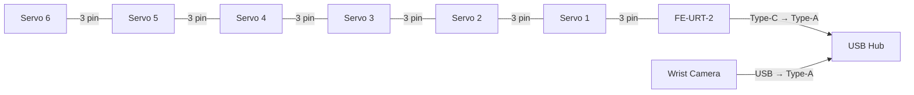
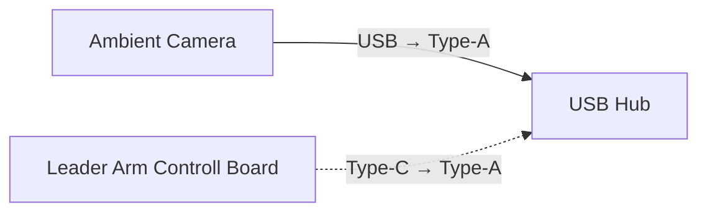
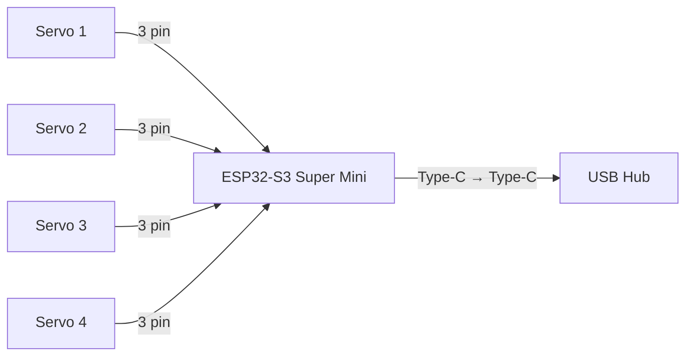
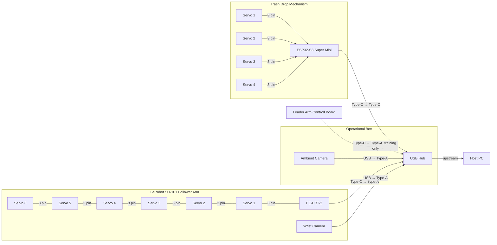
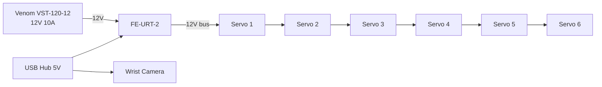
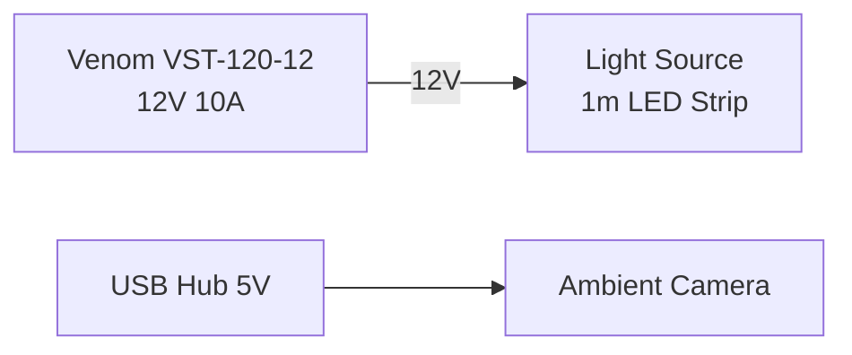
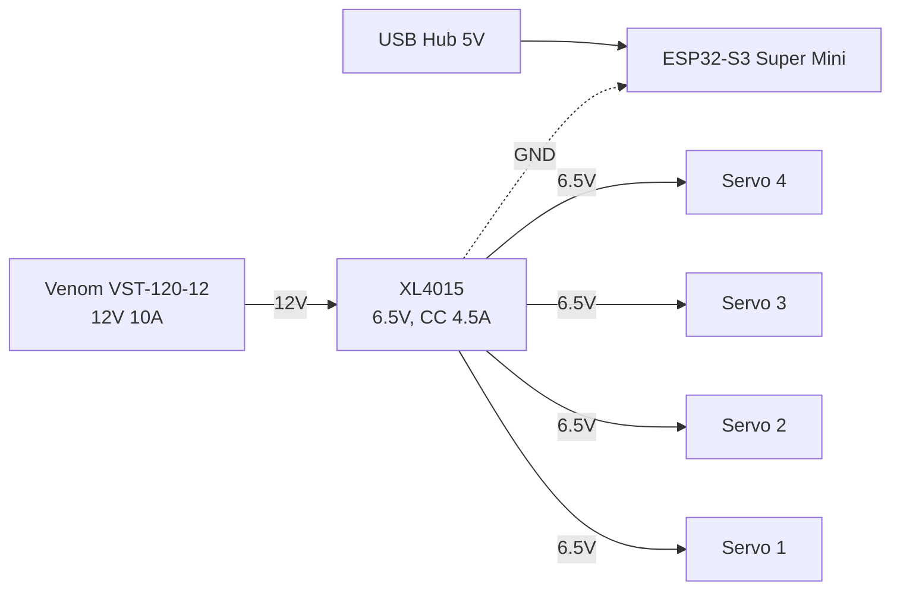
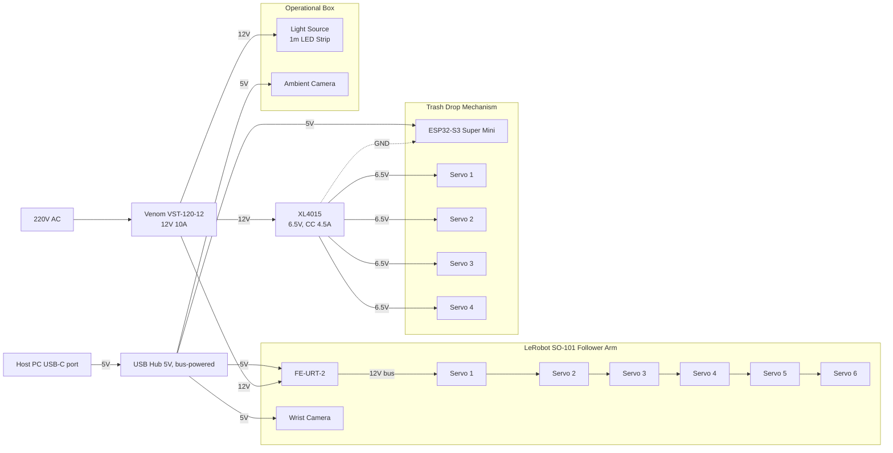

> **Previewing this file in VS Code:** the diagrams are Mermaid blocks. To render them in the built-in Markdown preview (`Ctrl+Shift+V`):
>
> - Install **Markdown Preview Mermaid Support** (`bierner.markdown-mermaid`)
> - Optional: install **Markdown Preview GitHub Styling** (`bierner.markdown-preview-github-styles`) for the GitHub look
> - Disable **Markdown Github Preview** (`lzm0x219.vscode-markdown-github`) and **Mermaid Preview** (`vstirbu.vscode-mermaid-preview`): they conflict with each other and leave diagrams empty or show "No diagram type detected"
> - Reload the window (`Developer: Reload Window`) after changing extensions
>
> On GitHub, the diagrams render without any setup.

## Components

### LeRobot SO-101 (Follower Arm)

- Servos: 6x Feetech STS3215-C001 12V Servo
- Wrist camera: generic UVC camera on an Alpha Imaging Tech. (AIT) chip, reported as "SEMIC Camera"
- Controll Board: Feetech FE-URT-2 Servo Debug Programmer, USB Type-C to TTL/RS485 Bus Adapter with CH343P

### Operational Box

- Ambient camera: Logitech Webcam C270 (USB `046d:0825`, 720p UVC)
- Light Source: 1m of LED strip Ecolight 5050 14.4W/m IP20 12V 4000K (60 LED/m, 860 lm/m)
- USB Hub: USB Hub Dynamode USB-C/A 8-in-1 1xUSB-C + 1xUSB 3.0 + 3xUSB 2.0 + 3.5mm audio + SD/TF silver (BYL-2218TU)

### Trash Drop Mechanism

- Servos: 4x RDS3115 7.2V 180 deg
- Servo controller: ESP32-S3 Super Mini 

## Data Connections

### LeRobot SO-101 (Follower Arm)

Servo bus (daisy chain, 3-pin TTL bus cable):

```
Servo 6 ──3pin── Servo 5 ──3pin── Servo 4 ──3pin── Servo 3 ──3pin── Servo 2 ──3pin── Servo 1 ──3pin── FE-URT-2
```

| From         | Port   | To      | Port   |
| ------------ | ------ | ------- | ------ |
| FE-URT-2     | Type-C | USB Hub | Type-A |
| Wrist Camera | USB    | USB Hub | Type-A |



### Operational Box

| From                     | Port   | To      | Port   |
| ------------------------ | ------ | ------- | ------ |
| Ambient Camera           | USB    | USB Hub | Type-A |
| Leader Arm Controll Board | Type-C | USB Hub | Type-A |



> Leader Arm is outside of scope of this box and used only for training, so one type a port reserved for it on USB Hub, but it have its independed power supply(but with similar ground)

### Trash Drop Mechanism

| From                | Port   | To                  | Port   |
| ------------------- | ------ | ------------------- | ------ |
| ESP32-S3 Super Mini | Type-C | USB Hub             | Type-C |
| Servo 1             | 3 pin  | ESP32-S3 Super Mini | GPIO   |
| Servo 2             | 3 pin  | ESP32-S3 Super Mini | GPIO   |
| Servo 3             | 3 pin  | ESP32-S3 Super Mini | GPIO   |
| Servo 4             | 3 pin  | ESP32-S3 Super Mini | GPIO   |



### All Data Connections



## Power Demand

Values marked *est.* are typical values for this class of device (no datasheet available) and should be verified with a USB power meter.

### LeRobot SO-101 (Follower Arm)

| Item                     | Qty | Voltage | Current (each)                  | Power (each)              | Power (total)                 |
| ------------------------ | --- | ------- | ------------------------------- | ------------------------- | ----------------------------- |
| Feetech STS3215-C001 12V | 6   | 12V     | 0.18A no-load / 2.7A stall      | 2.2W no-load / 32.4W stall | 13W no-load / 194W all stalled |
| FE-URT-2 (CH343P logic)  | 1   | 5V USB  | ~0.03A *est.*                   | ~0.15W                    | ~0.15W                        |
| Wrist Camera (AIT SEMIC) | 1   | 5V USB  | ~0.15–0.25A *est.*, ≤0.5A (USB 2.0 limit) | ~0.75–1.25W    | ~0.75–1.25W                   |

> All 6 servos stalling at once is the worst case and won't happen in normal operation. A realistic peak during fast moves is around 3–5A at 12V.

### Operational Box

| Item                    | Qty | Voltage | Current (each)                     | Power (each) | Power (total) |
| ----------------------- | --- | ------- | ---------------------------------- | ------------ | ------------- |
| LED Strip Ecolight 5050 | 1m  | 12V     | 1.2A                               | 14.4W        | 14.4W (1.2A)  |
| Logitech C270           | 1   | 5V USB  | ~0.2A *est.*, ≤0.5A (USB 2.0 limit) | ~1W         | ~1W           |
| USB Hub BYL-2218TU      | 1   | 5V USB  | ~0.05A *est.* (own consumption)    | ~0.25W       | ~0.25W        |

### Trash Drop Mechanism

| Item                | Qty | Voltage           | Current (each)                              | Power (each)                 | Power (total)                  |
| ------------------- | --- | ----------------- | ------------------------------------------- | ---------------------------- | ------------------------------ |
| RDS3115             | 4   | 6.5V (XL4015)     | 0.1A no-load / 2.5–3A stall (at 6V)         | 0.6W no-load / 15–18W stall (at 6V) | 2.4W no-load / 60–72W all stalled |
| ESP32-S3 Super Mini | 1   | 5V USB            | ~0.1A typ., up to ~0.35A with Wi-Fi TX *est.* | ~0.5W typ. / ~1.75W peak   | ~0.5–1.75W                     |

### Summary per Rail

| Rail          | Consumers                                     | Typical  | Peak (worst case)       |
| ------------- | --------------------------------------------- | -------- | ----------------------- |
| 12V           | 6x STS3215, 1m LED strip                       | ~2.3A / 27W | 17.4A / 209W         |
| 6.5V (XL4015) | 4x RDS3115                                     | ~0.4A    | 10–12A, limited to 4.5A by XL4015 CC |
| 5V USB (hub)  | FE-URT-2, Wrist Camera, C270, ESP32-S3, hub    | ~0.6A / 3W | ~1.4A / 7W            |

> The USB hub is bus-powered, so all 5V USB devices share the current of a single host port: 0.9A on USB 3.0 Type-A, 1.5–3A on Type-C. The Leader Arm board also plugs into this hub, but only for data.

## Power Supply

### Power Modules

| Module | Input | Output | Rated current | Settings | Feeds |
| ------ | ----- | ------ | ------------- | -------- | ----- |
| Venom VST-120-12 Standart IP20 | 220V AC | 12V DC | 10A (120W) | V.ADJ at 12.0V | FE-URT-2 power input (6x STS3215), LED strip, XL4015 |
| XL4015 CC/CV step-down module | 12V DC (from Venom) | 6.5V DC | 5A peak, ~3A continuous | CV: 6.5V, CC: ~4.5A | 4x RDS3115 |
| USB Hub BYL-2218TU (bus-powered) | 5V from host PC USB-C | 5V | host port limit (1.5–3A on USB-C) | — | FE-URT-2 logic, Wrist Camera, C270, ESP32-S3 |

12V budget on the Venom (10A):

| Consumer | Typical | Realistic peak |
| -------- | ------- | -------------- |
| 6x STS3215 (arm) | ~1.1A | ~5A |
| 1m LED strip | 1.2A | 1.2A |
| XL4015 → 4x RDS3115 (12V side, ~90% efficiency) | ~0.25A | ~2.7A at the 4.5A CC limit |
| **Total** | **~2.6A** | **~8.9A** |

> The XL4015 current limit (CC) keeps the drop servos from overloading the Venom when they stall: 4.5A × 6.5V ÷ 0.9 ÷ 12V ≈ 2.7A drawn from 12V.

Setup and wiring notes:

- Set the Venom output to 12.0V with its V.ADJ trimmer before connecting loads.
- Set the XL4015 before connecting servos: with no load, turn CV to 6.5V (multimeter on the output); then put the multimeter in 10A mode directly across the output and turn CC to ~4.5A.
- 10A fuse on the Venom 12V output. Wire: ≥1.5mm² from the Venom to the 12V split, ≥1mm² to the FE-URT-2 and the XL4015, 0.5mm² to the LED strip.
- 2200µF 16–25V capacitor across 12V/GND at the FE-URT-2 power input.
- 1000–2200µF 16V capacitor across 6.5V/GND at the RDS3115 power split.
- XL4015 output GND must be tied to the ESP32-S3 GND (common ground for the servo signals).
- The Venom has exposed 220V screw terminals (IP20): cover them and mount the unit away from the trash sorting area (dust).

### LeRobot SO-101 (Follower Arm)

| Source     | Voltage | Consumer                                                   |
| ---------- | ------- | ---------------------------------------------------------- |
| USB Hub    | 5V      | FE-URT-2 (logic)                                           |
| USB Hub    | 5V      | Wrist Camera                                               |
| Venom VST-120-12 | 12V | FE-URT-2 power input → Servo 1 → Servo 2 → Servo 3 → Servo 4 → Servo 5 → Servo 6 (via bus) |



### Operational Box

| Source     | Voltage | Consumer       |
| ---------- | ------- | -------------- |
| Venom VST-120-12 | 12V | Light Source (1m LED strip) |
| USB Hub    | 5V      | Ambient Camera |



### Trash Drop Mechanism

| Source           | Voltage    | Consumer            |
| ---------------- | ---------- | ------------------- |
| USB Hub          | 5V         | ESP32-S3 Super Mini |
| Venom VST-120-12 | 12V        | XL4015 input        |
| XL4015           | 6.5V       | Servo 1             |
| XL4015           | 6.5V       | Servo 2             |
| XL4015           | 6.5V       | Servo 3             |
| XL4015           | 6.5V       | Servo 4             |



### All Power Connections


